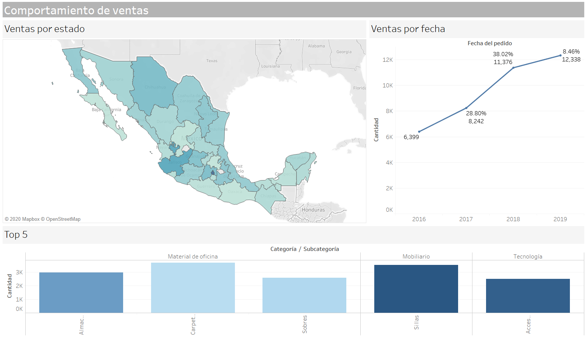

# Workshop Tableau <!-- omit in toc -->

Comportamiento de ventas en Tableau

## Tabla de Contenido<!-- omit in toc -->
- [¿Qué es la inteligencia de negocios?](#qué-es-la-inteligencia-de-negocios)

# El proyecto

Realizar mediante la base de datos Supertienda un dashboard que represente las ventas en un mapa, por estado, reflejando las ventas en el tiempo, así como ver su comportamiento por categoría/subcategoría.

* Debe de filtrarse de forma dinámica el dashboard

## Requisitos

* Tableau Desktop instalado
* Descargar el repositorio con el dataset
* Archito Tableau

## Resultado

  

